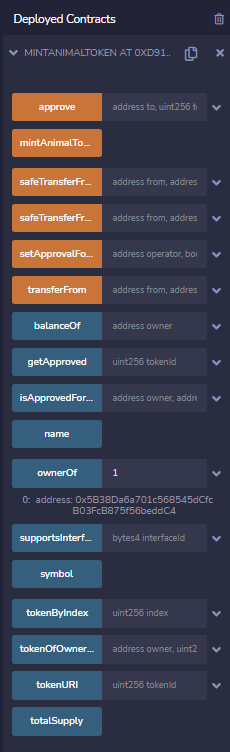

# 스마트 컨트랙트 작성

## 첫번째 스마트 컨트랙트

import "@openzeppelin/contracts/token/ERC721/extensions/ERC721Enumerable.sol";

ERC721 -> NFT

오픈 제플린의 ERC721Enumerable에서는 ERC721에서 좀더 확장된 기능을 제공해준다.

배포 후에모습,  mintAnimalToken만 만들었지만 다른 기능들은 제플린에서 제공해 준 것.

mintAnimalToken을 눌러서 animaltoken을 민팅한 후 ownerOf 에서 번호를 call하면 그 NFT의 주인(주소)를 보여줌.

## 판매함수 작성

주인이 판매 계약 스마트컨트랙트에 넘겼는지 확인하는 require문:

require(mintAnimalTokenAddress.isApprovedForAll(animalTokenOwner, address(this)), "Animal token owner did not approve token.");

---

mint 스마트컨트랙트 deploy -> deploy한 mint 스마트컨트랙트 address를 sale 스마트컨트랙트를 deploy할 때 인자로 넣어준다.

판매를 하기위해 먼저 mint에서 토큰하나 생성.(민트하나 해줌), animal types에 1넣어서 잘 되었는지 확인

여기서 sale 컨트랙트로 가서 setForSaleAnimalToken에 1번을 10원에 판다고 transact하면 오류뜸

why? 위의 require문에서 걸렸기 때문, 이를 해결하기 위해 다시 mint contract로

isApprovedForAll에 operator에 sale CA address를 넣고 owner에 계정주소를 넣고 call하면 false로 나옴, 이를 true로 바꿔야함

-> setApprovedForAll의 operator에 sale CA, approved에 true넣고 실행 (owner계정에서 실행해야함)

이후 isApprovedForAll하면 true 되어있는걸 확인할 수 있고 setForSaleAnimalToken도 정상 실행된다.

 